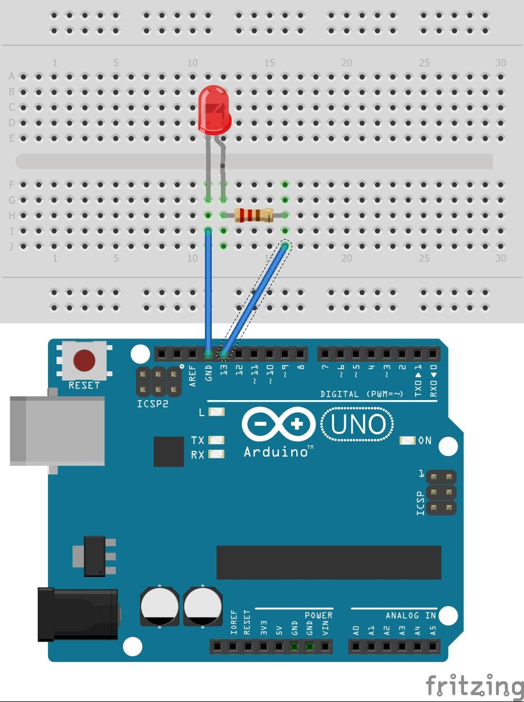

# Hello Arduino
## Description
This was my first assignment!  I had to wire an LED up and get it to blink.  I had never done this before, but I figured it out (with some help.) 
## Lesson(s) Learned
* Google is your friend
* The long leg of the LED goes toward high voltage; the short leg goes toward ground
* Red, red, brown is a 220 &Omega; resistor
## Wiring Diagram

# Finite LED Blinker

change